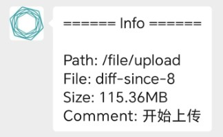
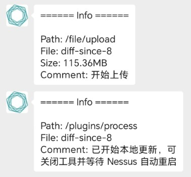

# Nessus Update

Nessus Scanner (SC) 的更新工具

## 快速使用

1. 找负责 nessus 的管理员，把更新地址改成`xxx.nessus-update.chenql.cn`（xxx 是自己的邮箱用户名，即@前面的内容）。
2. 找技保大师添加反向代理路径。
3. 打开默认`nessus-update.conf`并修改以下 xxx 处：
   - `[nessus].username/password`：扫描器安装时设置的用户名和口令
   - `[v2ray].user`：自己的邮箱用户名，即@前面的内容
   - 其他不要动！
4. 打开 `nessus-update.exe`，开在后台（不用关本机防火墙）。
5. 找 nessus 管理员发起更新推送，或者等 SC 自动下发更新（每 15 分钟下发一次）。更新时控制台有日志输出，如果绑定了微信将有进度提示。一般更新包需要传输 3-15 分钟不等，并花费 10 分钟至 20 分钟安装，安装时占用所有 CPU 和大量磁盘 I/O，请耐心等待。

## 故障排除

### 控制台长时间无任何输出

1. 检查电脑是否联网
2. 在浏览器访问[https://xxx.nessus-update.chenql.cn:8834]()，检查是否能打开本机扫描器。打不开找技保大师
3. 检查[快速使用](#快速使用)的步骤(1)是否做过

### 控制台有输出但微信无提示

1. 检查本机扫描器的用户名和口令，是否和 SC 中预留的信息一致

### 长时间卡在“开始上传”

1. 一般更新包需要传输 3-15 分钟不等。网络稳定时，每 100MB 大约需要 3 分钟。如果时间过长，检查网络是否稳定

### 提示关闭工具后特征库依然未更新

1. 更新包需花费 10 分钟至 20 分钟安装，安装时占用大量 CPU 和磁盘 I/O。可在任务管理器中监控`nessusd.exe`的状态，不占用 CPU 时即更新完毕

## 高级功能

### OSS 缓存

在线更新时，服务器将尝试缓存完整插件包`all-2.0.tar.gz`至 OSS。更新工具启动时会从 OSS 读取缓存的插件包版本，如果版本较新，将提示用户从 OSS 下载插件包进行离线更新（下载速度将比在线更新快）。下载的插件包`all-2.0.tar.gz`保存在工具同目录。

OSS 缓存的地址可在配置文件的`[oss]`节中设置。当前默认下载地址为：

- [http://static.chenql.cn/nessus/all-2.0.tar.gz](http://static.chenql.cn/nessus/all-2.0.tar.gz)

### 离线更新

工具支持离线更新功能，可预先从 OSS 或其他地方下载完整插件包`all-2.0.tar.gz`，并保存在工具同目录。如果本地已经有完整插件包，更新工具启动时会校验其有效性并进入离线更新模式。

### 更新非本机扫描器

默认情况下，`[nessus].host`设置为`127.0.0.1`，即更新本机扫描器。此时无需关闭防火墙，反向代理将绕过本机防火墙设置。若有需要，可通过修改以下配置实现更新非本机扫描器：

- `[nessus].username/password`：对方扫描器安装时设置的用户名和口令
- `[nessus].host`：对方的网络地址（如`192.168.1.2`）

更新非本机扫描器时，需保证对方的扫描器（如`https://192.168.1.2:8834`）可以通过浏览器访问，必要时让对方关闭防火墙。且对方的扫描器的端口必须为 8834。

## 技术说明

### 反向代理

在线更新功能由反向代理服务器 (v2ray) 实现，v2ray 的参数可在配置文件的`[v2ray]`节中设置。当前默认配置项为：

- `address` nessus-update.chenql.cn
- `port` 8835

反向代理客户端依赖`v2ray-core:v5`，需从其[Github Release](https://github.com/v2fly/v2ray-core/releases)下载`v2ray-windows-64.zip`后，解压`v2ray.exe`文件放在工具同目录。以压缩包方式分发的更新工具已自带了该组件。

### 更新原理

对于由 SC 控制的 Nessus Scanner，SC 大约每 15 分钟发送心跳包检测客户端存活情况，并在必要时更新客户端特征库（Plugin Set）。若特征库版本差值小于某个值（大约一个月），SC 将下发差异更新包，文件名类似`diff-since-xx`。若特征库一个月以上没有更新，SC 将下发完整更新包`all-2.0.tar.gz`。

一般完整更新包需要花费 10 分钟至 20 分钟更新，更新时占用所有 CPU 和大量磁盘 I/O。
